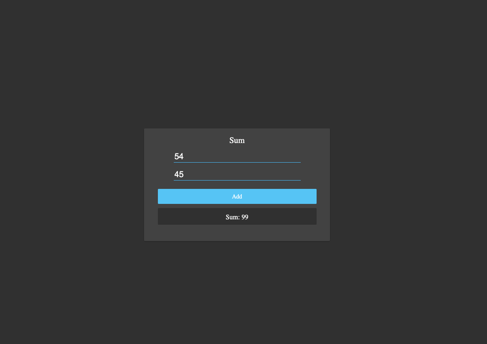

# REACT TOY PROBLEM ( Add Two Integers )

## Project Description

In this project we will create a react computer science toy problem. The file structure has already been created for us but none of the functionality works. At the end of this project you should have an understanding of the following topics:

* Components
* State
* Import / Export
* .gitignore
* NPM install

## Setup Project

* `cd` into the project directory.
* Run `npm install`.
* Then run `npm start`.

## Steps for Component

### Problem Summary

Let's build out the `Sum` component.

### Detailed Instructions

<b>Summary:</b> Given two numbers, calculate the sum and display it.

<b>The component outline:</b> One parent `div` element, one `h4` element, two `input` elements, one `button` element, and one `span` element.

* Open src/components/..

* Create file: src/components/Sum/Sum.js.

* Remove the `<p>` element from the `return` of the `render` method.

* Add the component outline to the `return` of the `render` method.

* Add the following `className` props to the outline:
  * `div` - className="puzzleBox sumPB"
  * The two `input` - className="inputLine"
  * `button` - className="confirmationButton"
  * `span` - className="resultsBox"

* Assign the `h4` element the `value` of `"Sum"`.

* Create a `constructor` method that creates an initital state:
  * `number1` - This should default to `0`.
  * `number2` - This should default to `0`.
  * `sum` - This should default to `null`.

* Create an `onChange` prop for the first `input` element that updates the value of `number1` on state.

* Create an `onChange` prop for the second `input` element that updates the value of `number2` on state.

* Create an `onClick` prop for the button element that calls a method on the class:
  * This method should solve the toy problem.
  * This method should update the value of `sum`.

* Assign the `span` element the value of `sum`.

<details>

<summary> Instructions </summary>

<br />

Start by rendering our component's outline

```js
  render() {
    return (
      <main className="sum_box">
        <h4> Sum </h4>
        <input className="input_1" type="number"/>
        <input className="input_1" type="number"/>
        <button className="add_button"> Add </button>
        <span className="results"></span>
      </main>
    )
  }
```

Now that we have a rough draft of everything our component will need, let's start filling in the functionality. We will use state to keep track of two numbers the user gives us and the sum of those two numbers.

```js
  constructor() {
    super();

    this.state = {
      number1: 0,
      number2: 0,
      sum: null
    }
  }
```

Next, let's update our `span` element to display `sum`.

```js
  render() {
    return (
      <main className="sum_box">
        <h4> Sum </h4>
        <input className="input_1" type="number"/>
        <input className="input_1" type="number"/>
        <button className="add_button"> Add </button>
        <span className="results"> Sum: {this.state.sum} </span>
      </main>
    )
  }
```

Next, let's update our `input` elements to handle user input

```js
  updateNumber_1(val) {
    this.setState({ number1: parseInt(val, 10) });
  }

  updateNumber_2(val) {
    this.setState({ number2: parseInt(val, 10) });
  }

  render() {
    return (
      <main className="sum_box box_sum">
        <h4> Sum </h4>
        <input className="input_1" type="number" onChange={ (e) => this.updateNumber_1(e.target.value) }/>
        <input className="input_1" type="number" onChange={ (e) => this.updateNumber_2(e.target.value) }/>
        <button className="add_button"> Add </button>
        <span className="results"> Sum: {this.state.sum} </span>
      </main>
    )
  }
```

Finally, let's update our `button` element to update the value of `sum`.

```js
  add(num1, num2) {

  }

  render() {
    return (
      <main className="sum_box">
        <h4> Sum </h4>
        <input className="input_1" type="number" onChange={ (e) => this.updateNumber_1(e.target.value) }/>
        <input className="input_1" type="number" onChange={ (e) => this.updateNumber_2(e.target.value) }/>
        <button className="add_button" onClick={ () => this.add(this.state.number1, this.state.number2) }> Add </button>
        <span className="results"> Sum: {this.state.sum} </span>
      </main>
    )
  }
```

Solve the toy problem how you see fit.
</details>

### Solution

<details>

<summary> <code> Sum.js </code> </summary>

<br />

```js
import React, { Component } from 'react';

export default class Sum extends Component {

  constructor() {
    super();

    this.state = {
      number1: 0,
      number2: 0,
      sum: null
    }
  }

  updateNumber_1(val) {
    this.setState({ number1: parseInt(val, 10) });
  }

  updateNumber_2(val) {
    this.setState({ number2: parseInt(val, 10) });
  }

  add(num1, num2) {
    this.setState({ sum: num1 + num2 });
  }

  render() {
    return (
      <main className="sum_box">
        <h4> Sum </h4>
        <input className="input_1" type="number" onChange={ (e) => this.updateNumber_1(e.target.value) }/>
        <input className="input_1" type="number" onChange={ (e) => this.updateNumber_2(e.target.value) }/>
        <button className="add_button" onClick={ () => this.add(this.state.number1, this.state.number2) }> 
          Add
        </button>
        <span className="results"> Sum: {this.state.sum} </span>
      </main>
    )
  }
}
```

</details>

<br />

<!-- PLACE MY OWN IMAGE IN HERE OF RESULT -->


## Resources

<details>

<summary> <code> Components </code> </summary>

```js
// A typical React component is comprised of several pieces outlined below

// Import statements allow us to import JavaScript from external modules
// or our own files contained in our project
import React, { Component } from 'react';


// React uses es6 Classes for it's components.
// We extend from the `Component` module to get access to the `render` method
class MyComponent extends Component {
  
  // The constructor is where we declare our state and other information
  constructor() {
    super();
  
    // this.state is an object that houses local data our component cares about
    this.state = {
      name: 'Steven'
    };
  }

  // render will return JSX (HTML-like syntax). This is what's rendered to the screen
  render() {

    // JSX uses HTML-like syntax to create our component content
    // It uses single curly braces `{}` to inject JavaScript into our HTML
    return <h1 onClick={() => alert('Clicked!')}>Hello, {this.state.name}!</h1>
  }
}

// export allows our component to be `import`ed into another file
export default MyComponent;
```

* [JSX](https://reactjs.org/docs/introducing-jsx.html)

</details>
